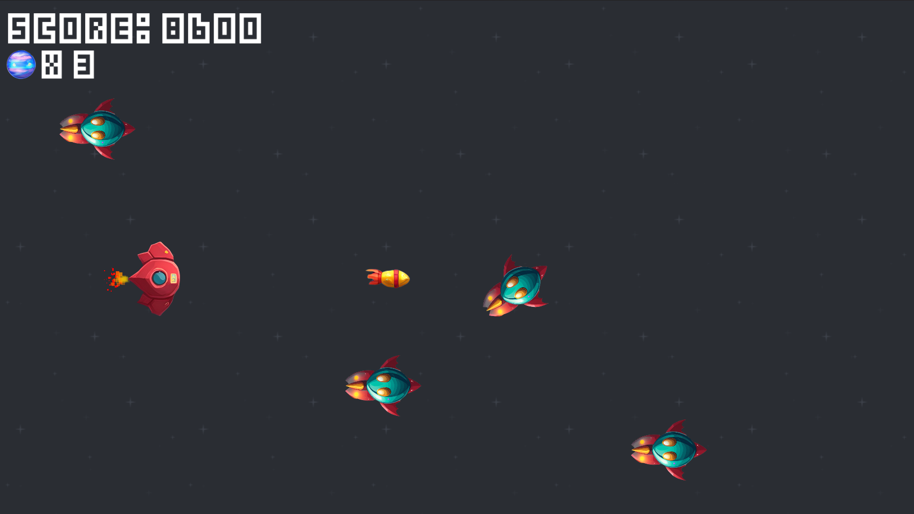

# Alien_Attack

   This game was create by following the course on gamedev.tv "Complete Godot 4 2D: Code Your Own 2D Games In Godot 4!"
    

## Objective 
    
   In Alien Attack, the player controls a spaceship and must shoot down incoming enemies while avoiding their attacks. The goal is to survive as long as possible and eliminate as many aliens as possible

## Control 

### Movement 
    Arrow Key
    ZQSD
    space : shoot

## Available 
     Windows
     Linux

## Download

[Alien Attack(Window)](https://github.com/Elkantar/Alien_Attack/releases/download/Alien_Attack_1.0/Alien_Attack_Windows.zip)   
   [Alien Attack(Linux)](https://github.com/Elkantar/Alien_Attack/releases/download/Alien_Attack_1.0/Alien_Attack_Linux.zip)

## linux 
Giving Permissions to Run the Game

Before you can run the game, you'll need to give the executable file proper permissions. You can do this by using the following command in your terminal:
````
chmod +x Alien_Attack.x86_64
````
This command grants execute permissions to the file, allowing it to be run as a program. After running this command, you can execute the game by using the following:
````
./Alien_Attack.x86_64
````
Make sure you're in the correct directory where the game file is located, or provide the full path to the executable.
